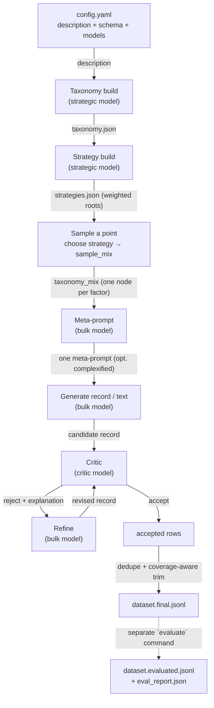
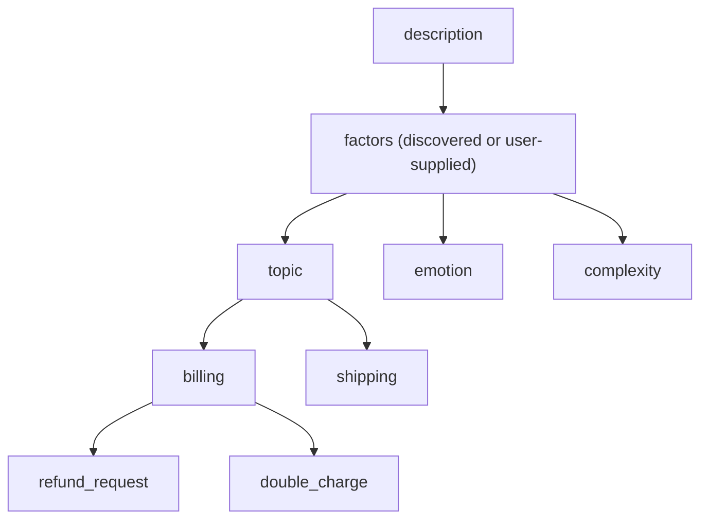
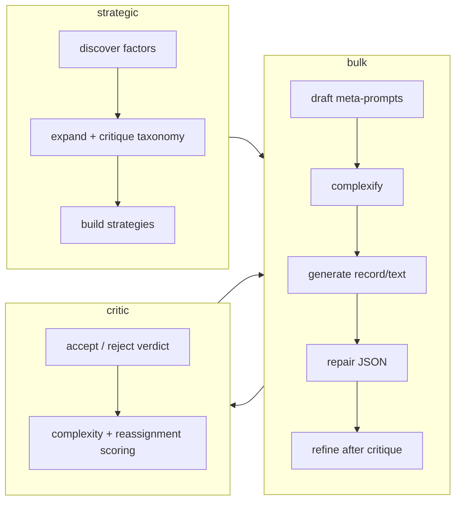

# simula — Concepts & Configuration

This page explains how `simula` actually works: the pipeline, the model roles, and every
configuration knob you can turn. It is built from the source, not the marketing. Where the code and
the older docs disagree, the note says so.

> Source of truth for defaults and validation is `simula/data_models.py`. The copy-me skeleton is
> `examples/template.yaml`; the exhaustive per-field reference is `CONFIG.md`. This page is the
> conceptual map that ties them together.

## Contents

- [1. Quickstart mental model](#1-quickstart-mental-model)
- [2. Core concepts](#2-core-concepts)
  - [Taxonomy](#taxonomy)
  - [Schema](#schema)
  - [The model roles (there are three, not four)](#the-model-roles-there-are-three-not-four)
- [3. Overriding defaults ← start here](#3-overriding-defaults--start-here)
- [4. Annotated end-to-end example](#4-annotated-end-to-end-example)
- [5. Configuration reference](#5-configuration-reference)
- [6. Gotchas & current limitations](#6-gotchas--current-limitations)

---

## 1. Quickstart mental model

One YAML config drives everything. From a plain-English **description** (and an optional
**schema**), `simula` first maps the space of things to generate (a **taxonomy**), decides how to
sample that space (**strategies**), then repeatedly samples a point, turns it into a **meta-prompt**,
generates a record, and runs a **critic → refine** loop before accepting it. Everything is written
to human-readable JSON/JSONL artifacts as it happens.



The `run` command executes taxonomy → generate → evaluate end to end. You can also run each phase on
its own (`validate`, `taxonomy`, `generate`, `evaluate`) — for example, build and hand-edit
`taxonomy.json` before spending any generation calls. For finer control, `--stop-after
{taxonomy,strategies,meta_prompts}` (or `generation.stop_after` in the config) halts `generate`/`run`
once that stage's artifact is written; edit it and rerun to continue (existing artifacts are reused).

> **Note the arrows into the models.** Every step is one model role. The taxonomy and strategies are
> built by `strategic`; the records are written by `bulk`; the accept/reject verdict is `critic`; and
> the *refine* that follows a rejection is done by `bulk` again (not the critic). See
> [the model roles](#the-model-roles-there-are-three-not-four).

---

## 2. Core concepts

### Taxonomy

**What it is:** a shallow tree of the *factors of variation* your dataset should cover. For a
customer-support dataset the factors might be `topic`, `emotion`, `complexity`; each factor is
expanded breadth-first into child categories down to `taxonomy.depth` levels.

**Why it exists:** generating N records from one prompt gives you N variations of roughly the same
thing. The taxonomy is the coordinate system that forces coverage — every generated point is
conditioned on one node per factor, and that lineage is saved on the row so you can audit spread.

It is built by the `strategic` model (or you can hand-write the factors in config), written to
`taxonomy.json`, and — depending on `taxonomy.review_mode` — either used immediately or left for you
to edit first.



### Strategies & sampling

**What they are:** `strategies.json` is a small set of model-drafted **thematic lanes**. Each
strategy has `taxonomy_roots` (which regions of the tree it samples from — a bare factor name means
"that factor's full tree"), a `weight` (how often the lane is used), and optionally `never_combine`
(pairs of paths that must not appear in the same mix). Every root and rule path is validated against
the real tree when strategies are built — an invalid path is a loud error, not a silent no-op — and
`strategy.count` pins how many strategies are requested.

**How a point is sampled:** pick a strategy by weight, then for **every** factor (unmentioned ones
included — they sample their full tree) walk the tree level by level, choosing among siblings by
their per-node `weight` (default `1.0`, `0` disables a branch), down to a leaf. A mix that violates a
`never_combine` pair is redrawn. Because the walk is level-wise, a branch's probability comes from
its *weight*, never from how finely the builder happened to subdivide it.

**Why you should read these artifacts:** the taxonomy's node weights and the strategies' bundles
*are* the dataset's distribution — they decide what "typical" looks like at scale, before any
generation money is spent. Both files are plain JSON, reused verbatim on rerun, and meant to be
hand-edited: review them the way you would review the schema.

### Schema

**What it is:** an optional JSON Schema (a supported subset) that every generated record must
validate against. Set `schema: null` (or omit it) for **free-text mode**, where each record is a
plain string instead of a JSON object.

**Why it exists:** it turns "generate some data" into "generate rows that fit *this* shape," and it
is enforced — a record that fails validation is repaired once, and rejected if it still fails.

Supported subset (enforced in `simula/config.py`): `object`, `string`, `number`, `integer`,
`boolean`, `array`, `enum`, `required`, and nested objects/arrays. An `object` with no `properties`
(like the `extraction` field in the e-commerce example) accepts any object — useful when the record
shape legitimately varies row to row.

### The model roles (there are three, not four)

`simula` calls **one OpenAI-compatible endpoint** (`provider`) with **three roles** defined under
`models`: `strategic`, `bulk`, and `critic`. They can all point at the same model id or three
different ones.

> **Heads-up on naming.** You may see the term "generator model" — e.g. the `generator_model` field
> on every output row. There is **no separate generator role**. Record generation is done by the
> **`bulk`** role, and `generator_model` is literally the `bulk` model id
> (`simula/generate.py`: `router.model_name("bulk")`). If you came looking for a `models.generator`
> block, use `models.bulk`.

| Role        | Responsible for (by task)                                                            | Produces                                  |
| ----------- | ------------------------------------------------------------------------------------ | ----------------------------------------- |
| `strategic` | `factor_discovery`, `node_expansion`, `taxonomy_critic`, `level_plan`, `strategy`    | the taxonomy tree and sampling strategies |
| `bulk`      | `meta_prompt`, `complexify`, `generate`, `repair`, `refine`                          | the meta-prompts **and** the actual records |
| `critic`    | `semantic_critic`, `complexity_score`, `node_assign`                                 | accept/reject verdicts and optional scores |



- **`strategic`** is the "design" model — it runs a few high-leverage calls up front (taxonomy +
  strategies) that are then reused for the whole run. Worth spending on a stronger model here.
- **`bulk`** does the volume work: it writes the meta-prompts *and* the records *and* the refinements.
  This is where most of your tokens and money go — a cheap/fast model is usually the right call.
- **`critic`** judges each record (`accept`/`reject` + an explanation) and, when enabled, does the
  optional complexity and reassignment scoring during evaluation.

A role set to `"model": "fake"` runs fully offline (deterministic, no API key) — used by the example
smoke tests.

---

## 3. Overriding defaults ← start here

**Almost every value in the config is a default you can override.** Only two things are truly
required: a non-empty `description`, and a `model` id for each of the three roles. Everything else has
a sensible default (from `simula/data_models.py`) and is omitted-means-default. You do **not** need to
copy the whole template — write only the keys you want to change.

### Config defaults: before / after

**Before** — the minimum viable config. Every unlisted knob uses its default (`target_size: 50`,
`taxonomy.depth: 2`, `temperature: 0.7`, etc.):

```yaml
description: "Concise Q&A pairs about practical machine-learning concepts."

schema:
  type: object
  required: ["input", "output"]
  properties:
    input:  { type: string }
    output: { type: string }

models:
  strategic: { model: "google/gemini-3-flash-preview" }
  bulk:      { model: "google/gemini-3-flash-preview" }
  critic:    { model: "google/gemini-3-flash-preview" }
```

**After** — the same run, overriding a handful of defaults. Each changed field is commented:

```yaml
description: "Concise Q&A pairs about practical machine-learning concepts."

schema:
  type: object
  required: ["input", "output"]
  properties:
    input:  { type: string }
    output: { type: string }

models:
  strategic: { model: "deepseek/deepseek-v4-pro" }      # stronger model for the one-time design phase
  bulk:      { model: "deepseek/deepseek-v4-flash" }    # cheap/fast model for the volume work
  critic:    { model: "deepseek/deepseek-v4-flash" }

taxonomy:
  depth: 3                # override default 2 → a deeper, finer tree
  children_per_node: 3    # override default 4 → fewer, broader branches

generation:
  target_size: 2000       # override default 50
  overgenerate_ratio: 1.5 # override default 1.3 → generate 50% extra to survive rejections
  concurrency: 24         # override default 4 → more in-flight calls (lower it if rate-limited)

sampling:                 # per-task decoding overrides — see below
  tasks:
    generate: { temperature: 1.1, top_p: 0.95 }   # hotter, more diverse records
    repair:   { temperature: 0.0 }                # deterministic JSON repair
```

### Decoding params override in three layers (last wins)

Temperature and friends resolve through `resolve_sampling` (`simula/models.py`):

```text
built-in defaults        {temperature: 0.7, max_tokens: 32768}
   └── models.<role>      e.g. models.bulk.temperature: 0.75
        └── sampling.tasks.<task>   e.g. sampling.tasks.generate.temperature: 1.1   ← wins
```

Each **task** is handled by exactly one role, so you name the *task*, not the role, in
`sampling.tasks`. Known OpenAI params (`temperature`, `top_p`, `max_tokens`, `frequency_penalty`,
`presence_penalty`, `stop`, `seed`) go as top-level call kwargs; anything else (`min_p`, `top_k`,
`repetition_penalty`, …) is passed through `extra_body`, so provider-specific knobs work without
lock-in. Valid task names are the `TaskType` values: `factor_discovery`, `node_expansion`,
`taxonomy_critic`, `level_plan`, `strategy`, `meta_prompt`, `complexify`, `generate`, `repair`,
`semantic_critic`, `refine`, `complexity_score`, `node_assign`.

### Overriding the prompts

Every built-in prompt lives in `simula/prompts.py` and is overridable per run by pointing at a Python
module. You override only the functions you care about; the rest fall back to the built-ins.

```yaml
prompts:
  module: "my_prompts.py"   # resolved relative to this YAML file
```

```python
# my_prompts.py — override any subset; keep the same parameter names as the built-ins.
SYSTEM_JSON = "Return valid JSON only."

def strategy_prompt(description, taxonomy, valid_paths, guidance=None, count=None):
    return f"Description:\n{description}\n\nTaxonomy:\n{taxonomy}\n\nUse only these paths verbatim:\n{valid_paths}\n\nReturn JSON with a strategies array."
```

`simula validate` imports the module and rejects a missing file, an import error, a non-string system
prompt, or a signature that does not match the built-in — before any model call runs.

---

## 4. Annotated end-to-end example

This is `examples/basic_qa.yaml`, verbatim — a real, runnable config that uses **fake models**, so it
executes fully offline with no API key:

```bash
python -m simula.cli run examples/basic_qa.yaml
```

```yaml
project:
  name: "basic_qa"
  output_dir: "runs/basic_qa"      # every artifact for this run lands here
  seed: 7                          # makes sampling + attempt scheduling reproducible

# The single most important field: it steers every prompt in the pipeline.
description: "A small dataset of concise question-answer pairs about practical machine learning concepts."

# JSON mode: records must validate against this schema (omit / null → free-text mode).
schema:
  type: object
  required: ["input", "output"]
  properties:
    input:  { type: string }
    output: { type: string }

# "fake" runs offline & deterministic — no network, no key. base_url is unused in fake mode.
provider:
  base_url: "fake"

models:                            # three roles; here all fake
  strategic: { model: "fake" }     # builds taxonomy + strategies
  bulk:      { model: "fake" }     # writes meta-prompts + records + refinements
  critic:    { model: "fake" }     # accept/reject verdicts

taxonomy:
  depth: 2                         # 2 levels below each factor root
  best_of_n: 1                     # candidate child lists per node before the critic refines
  review_mode: "auto_accept"       # write taxonomy.json and proceed (don't halt for editing)
  children_per_node: 2             # target children per node when expanding

generation:
  target_size: 5                   # rows wanted in dataset.final.jsonl
  overgenerate_ratio: 1.4          # attempts = ceil(5 * 1.4) = 7 (buffer for rejections)
  scenarios_per_mix: 2             # 2 candidate meta-prompts drafted per point; ONE is used
  complexity_ratio: 0.2            # ~20% of points routed through the complexify step
  max_refine_attempts: 1           # critic → refine at most once before rejecting
  concurrency: 1                   # in-flight model calls

evaluation:
  dedupe: true                     # n-gram dedupe in the evaluate phase
  coverage: true                   # taxonomy coverage report (lineage-based — see gotchas)
  complexity: false                # Elo complexity scoring off (it makes extra model calls)
```

**What comes out** (under `runs/basic_qa/`):

```text
taxonomy.json            # the factor tree
strategies.json          # weighted sampling strategies
meta_prompts.jsonl       # one meta-prompt row per attempt (strategy/mix lineage + prompt)
dataset.raw.jsonl        # every attempt, accepted or not (inspect rejection_reason here)
dataset.accepted.jsonl   # attempts that passed critique + schema
dataset.final.jsonl      # accepted rows after dedupe + coverage-aware trim to target_size
run_state.json           # checkpoint + resume fingerprint
llm_calls.jsonl          # every model call: prompts, response, timing, resolved params
cost_summary.json        # token + cost accounting
# after `evaluate`:
dataset.evaluated.jsonl  # deduped/decontaminated copy (final.jsonl is never rewritten)
eval_report.json         # counts, coverage, optional diversity/complexity
```

Each row in `dataset.final.jsonl` carries full lineage:

```json
{
  "id": "item-3-1a2b3c4d",
  "attempt_index": 3,
  "record": { "input": "What is overfitting?", "output": "When a model memorizes training noise..." },
  "output_format": "json",
  "taxonomy_mix": [ { "factor": "topic", "node": "generalization", "level": 1, "path": ["topic", "generalization"] } ],
  "strategy_id": "general",
  "meta_prompt": "Write a Q&A pair explaining overfitting for a beginner.",
  "complexified": false,
  "generator_model": "fake",          // == the bulk model id
  "critic_verdicts": [ { "verdict": "accept", "explanation": "..." } ],
  "schema_valid": true,
  "accepted": true,
  "rejection_reason": null,
  "created_at": "2026-07-29T12:00:00Z"
}
```

---

## 5. Configuration reference

Defaults and validation come from `simula/data_models.py`. "Overridable" means: set it in YAML to
change it (blank sections fall back to defaults). Required fields have no default.

### Top level

| Field         | What it does                                              | Default        | Overridable | Allowed values |
| ------------- | -------------------------------------------------------- | -------------- | ----------- | -------------- |
| `description` | Plain-English dataset description; steers every prompt.   | — **required** | yes         | non-empty string |
| `schema`      | JSON Schema subset records must validate against.         | `null`         | yes         | schema object, or `null`/omit for free-text |

### `project`

| Field        | What it does                                | Default        | Overridable | Allowed values |
| ------------ | ------------------------------------------- | -------------- | ----------- | -------------- |
| `name`       | Run label.                                  | `"pilot"`      | yes         | string |
| `output_dir` | Directory for all artifacts.                | `"runs/pilot"` | yes         | path string |
| `seed`       | Reproducibility seed for sampling/scheduling.| `42`          | yes         | integer |

### `provider` (one endpoint, shared by all roles)

| Field             | What it does                                             | Default                            | Overridable | Allowed values |
| ----------------- | ------------------------------------------------------- | ---------------------------------- | ----------- | -------------- |
| `base_url`        | OpenAI-compatible base URL (`"fake"` = offline).        | `"https://openrouter.ai/api/v1"`   | yes         | URL string / `"fake"` |
| `api_key_env`     | Env var name read **only** from project-root `.env`.    | `"OPENROUTER_API_KEY"`             | yes         | string |
| `timeout_seconds` | Per-request timeout.                                    | `180`                              | yes         | number > 0 |

### `models.<role>` — role ∈ {`strategic`, `bulk`, `critic`}

| Field        | What it does                                              | Default | Overridable | Allowed values |
| ------------ | -------------------------------------------------------- | ------- | ----------- | -------------- |
| `model`      | Model id for the role (`"fake"` = offline).              | — **required** per role | yes | string |
| `extra_body` | Provider pass-through (e.g. reasoning controls).         | `null`  | yes         | mapping |
| *(decoding)* | `temperature`, `top_p`, `max_tokens`, `min_p`, …         | see sampling defaults | yes | numbers; unknown keys pass through to `extra_body` |

### `taxonomy`

| Field               | What it does                                               | Default         | Overridable | Allowed values |
| ------------------- | --------------------------------------------------------- | --------------- | ----------- | -------------- |
| `depth`             | Levels below each factor root (`0` = factors only).       | `2`             | yes         | integer ≥ 0 |
| `factors`           | Hand-supplied factors; `null` lets the model discover 3–6.| `null`          | yes         | list of `{name, description}` or `null` |
| `best_of_n`         | Candidate child lists per node before the critic refines. | `2`             | yes         | integer > 0 |
| `review_mode`       | Whether the run halts for manual taxonomy edits.          | `"auto_accept"` | yes         | `auto_accept`, `write_then_edit`, `interactive_confirm` |
| `children_per_node` | Target children requested per node.                       | `4`             | yes         | integer > 0 |
| `log_style`         | How the build is shown.                                   | `"light"`       | yes         | `light`, `tree` |

### `strategy`

| Field      | What it does                                                        | Default | Overridable | Allowed values |
| ---------- | ------------------------------------------------------------------ | ------- | ----------- | -------------- |
| `guidance` | Free-text steering woven into the strategy prompt (roots + weights).| `null`  | yes         | string or `null` |
| `count`    | Exact number of strategies to request (`null` keeps the model's 2–5 choice). | `null` | yes | integer 1–12 or `null` |

### `sampling`

| Field   | What it does                                            | Default | Overridable | Allowed values |
| ------- | ------------------------------------------------------ | ------- | ----------- | -------------- |
| `tasks` | Per-task decoding overrides: `tasks.<task> → {param: value}`. | `{}` | yes | keys = `TaskType` values; known numerics type-checked, others pass through |

### `generation`

| Field                | What it does                                                       | Default | Overridable | Allowed values |
| -------------------- | ----------------------------------------------------------------- | ------- | ----------- | -------------- |
| `target_size`        | Rows wanted in `dataset.final.jsonl`.                             | `50`    | yes         | integer > 0 |
| `overgenerate_ratio` | `attempts = ceil(target_size * ratio)`; buffer for rejections.    | `1.3`   | yes         | float ≥ 1.0 |
| `scenarios_per_mix`  | Candidate meta-prompts drafted per point; **one is used**.        | `3`     | yes         | integer > 0 |
| `complexity_ratio`   | Fraction of points routed through the complexify step.            | `0.3`   | yes         | float 0.0–1.0 |
| `max_refine_attempts`| Critic→refine retries per record (`0` = critique once, no refine).| `2`     | yes         | integer ≥ 0 |
| `concurrency`        | In-flight model calls; lower if rate-limited.                     | `4`     | yes         | integer > 0 |
| `checkpoint_every`   | Write `run_state.json` every N completed attempts.               | `50`    | yes         | integer > 0 |
| `stop_after`         | Halt `generate`/`run` once this stage's artifact is written (edit it, rerun to continue). CLI `--stop-after` overrides; `--stop-after none` disables. | `null`  | yes         | `taxonomy`, `strategies`, `meta_prompts`, `null` |

### `evaluation`

| Field                         | What it does                                              | Default      | Overridable | Allowed values |
| ----------------------------- | -------------------------------------------------------- | ------------ | ----------- | -------------- |
| `dedupe`                      | N-gram dedupe in the evaluate phase.                     | `true`       | yes         | bool |
| `coverage`                    | Emit a taxonomy coverage report.                         | `true`       | yes         | bool |
| `coverage_mode`               | Lineage (call-free) vs. independent LLM reassignment.    | `"lineage"`  | yes         | `lineage`, `reassign`, `both` |
| `complexity`                  | Elo complexity scoring (extra model calls).              | `false`      | yes         | bool |
| `complexity_batch_size`       | Records per critic batch when scoring.                   | `5`          | yes         | integer > 0 |
| `complexity_samples_per_item` | Shuffled batches each record appears in.                 | `2`          | yes         | integer > 0 |
| `decontaminate_against`       | Reference/test JSONL paths to drop overlapping rows.     | `[]`         | yes         | list of paths |
| `diversity.enabled`           | Embedding diversity (needs `[diversity]` extra).         | `false`      | yes         | bool |
| `diversity.embedding_model`   | Sentence-transformers model id.                          | `all-MiniLM-L6-v2` | yes   | string |
| `diversity.k_local`           | Neighbours for the local-diversity metric.               | `10`         | yes         | integer > 0 |
| `diversity.sample_cap`        | Max rows embedded (random subset beyond this).           | `1000`       | yes         | integer > 0 |
| `diversity.text_field`        | Dotted path into the record to embed.                    | `null`       | yes         | dotted string or `null` |

### `prompts`

| Field    | What it does                                                    | Default | Overridable | Allowed values |
| -------- | -------------------------------------------------------------- | ------- | ----------- | -------------- |
| `module` | Python module overriding any subset of prompt builders + systems.| unset | yes | path string relative to the YAML |

---

## 6. Gotchas & current limitations

Each of these is expected behavior with a known workaround, not a bug.

### Taxonomy size is controlled by three knobs, and it compounds

`taxonomy.depth` sets how many levels grow below each factor root (`depth: 0` = factors only, no
children). `children_per_node` is requested per node at each level, so the leaf count grows roughly as
`children_per_node ^ depth` **per factor** — the default `depth: 2, children_per_node: 4` is ~16
leaves/factor, but `depth: 4, children_per_node: 4` is ~256 leaves/factor and a lot of `strategic`
calls plus concurrency bursts during the build. **Workaround:** for deep trees, drop
`children_per_node` to 3 (see the e-commerce example: depth 4 with `children_per_node: 3`), and build
the taxonomy once — it is written to `taxonomy.json` and reused on later runs in the same
`output_dir`.

### One record per attempt, and `scenarios_per_mix` does *not* multiply output

`scenarios_per_mix` (default `3`) asks the `bulk` model for several candidate meta-prompts per sampled
point — but the code then picks **exactly one** at random (`rng.choice`) and generates **one** record
from it (`simula/generate.py::_make_meta_prompt`). So the number of rows is driven by the **attempt
count**, not by `scenarios_per_mix`:

```text
attempts = ceil(target_size * overgenerate_ratio)   # one record per attempt
```

**Workaround:** to get more records, raise `target_size` (and keep `overgenerate_ratio` high enough to
survive rejections). Raising `scenarios_per_mix` only widens the meta-prompt lottery per point, adding
diversity — not volume. There is no batched/multi-record-per-prompt mode yet (it is on the roadmap in
`TODO.md`).

### Topic distribution is weighted, so over-represented labels dominate the *accepted* set

Strategies are chosen by **weighted random** (`choose_strategy`), and each pick samples one node per
factor under that strategy's roots via a level-wise walk weighted by each node's `weight` in
`taxonomy.json`. Higher-weight strategies — and higher-weight branches — are sampled proportionally
more often, so a raw accepted set skews toward whatever the strategic model (or your
`strategy.guidance`) emphasized. The final trim (`coverage_aware_trim`) greedily prefers rows that
add *unseen* taxonomy paths, which flattens the distribution **in `dataset.final.jsonl`** — but only up
to `target_size`, and it does not change the accepted-row distribution itself. **Workarounds for more
even coverage:**

- Set `strategy.guidance` to ask for broad, even coverage (the e-commerce example does exactly this).
- Edit `strategies.json` directly to flatten strategy `weight`s, or edit per-node `weight`s in
  `taxonomy.json`, then rerun `generate` (both files are reused).
- Over-generate more (`overgenerate_ratio`) so the coverage-aware trim has a larger pool to balance
  from.

### Coverage is scored from self-reported lineage, not verified record content

<!-- VERIFY: possible metric mismatch — coverage numerator uses the taxonomy_mix that was *requested*
     for each row, never a check that the generated record actually reflects that node. Confirm this is
     acceptable for the launch messaging before calling coverage an accuracy metric. -->

The default coverage report (`coverage_mode: "lineage"`) computes its numerator from each row's
`taxonomy_mix` — the node that was **sampled and passed into the meta-prompt** — against a denominator
of every node in `taxonomy.json` (`simula/evaluate.py::coverage_report`). It does **not** inspect the
generated `record` to confirm the model actually produced content for that node. So a reported "80%
coverage" means *80% of taxonomy nodes were requested at least once*, not *80% were verifiably
present in the data*. If the model drifted from a meta-prompt, lineage coverage will not catch it.

**Also note** the strategy→taxonomy matching can quietly widen lineage: if a strategy's
`taxonomy_roots` do not match any real path in the taxonomy, `sample_mix` falls back to sampling
**every** factor (so lineage is never empty) — which means the recorded coverage may reflect the
fallback, not the strategy you intended.

**Workaround:** for a coverage number based on independent judgment, set `coverage_mode: "reassign"`
(or `"both"`). That has the `critic` model classify each record into a taxonomy node itself, at the
cost of extra model calls. Treat lineage coverage as "what we asked for" and reassignment coverage as
"what we appear to have gotten."

### Other current limitations

- Generation is `asyncio`-concurrent and pilot-scale, not distributed.
- The client only speaks OpenAI-compatible chat completions (one shared `provider` for all roles;
  per-role endpoints/keys are not currently supported — see the cleanup note in `AGENTS.md`).
- The critic is single-pass by default (`max_refine_attempts: 2`).
- No database, web UI, fine-tuning harness, or multimodal support.
</content>
</invoke>
